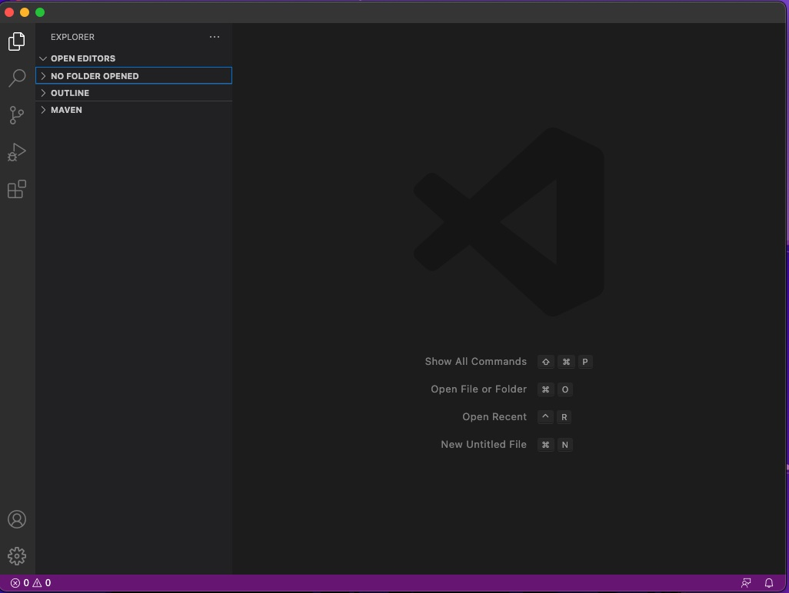
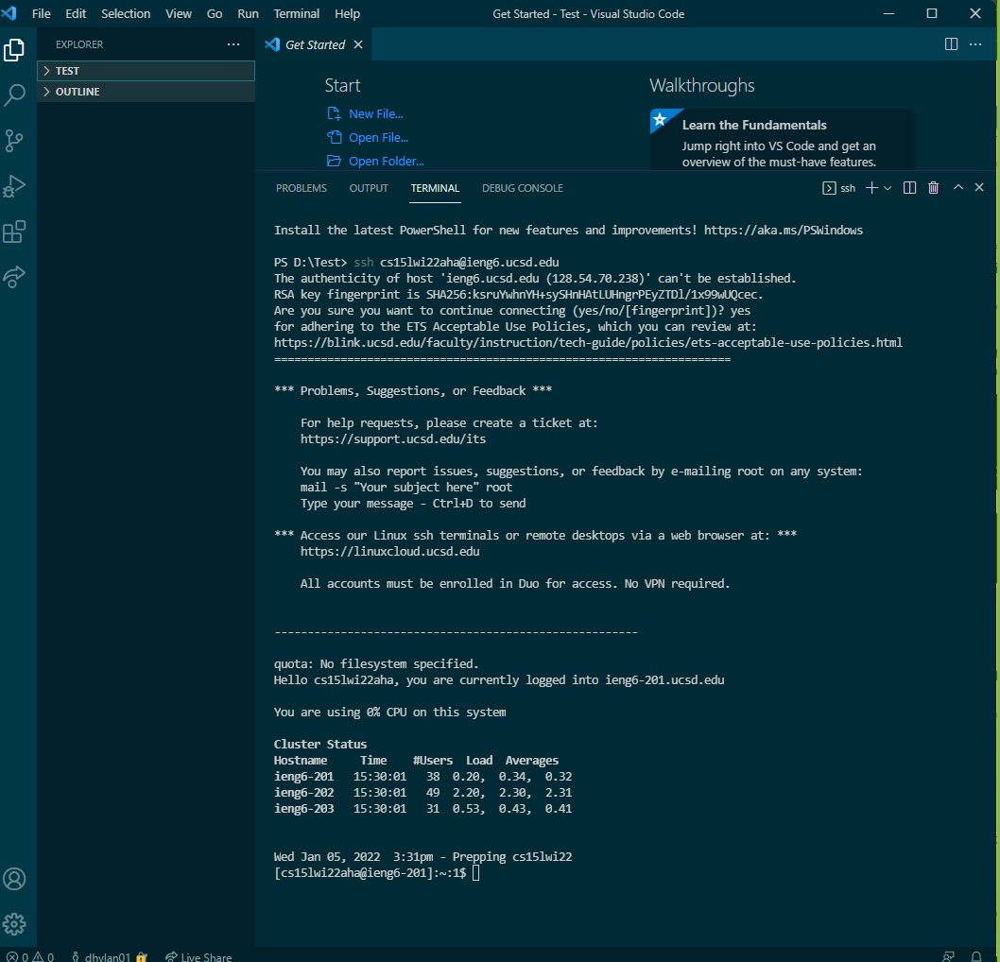
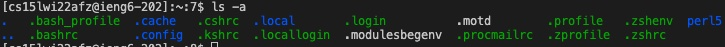
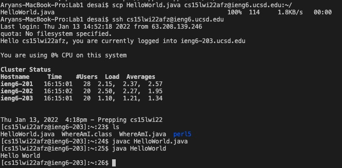
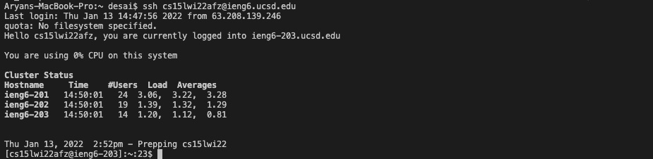
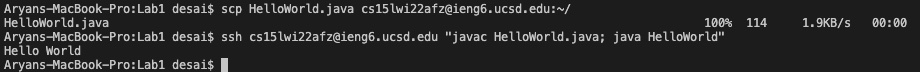

# Lab Report 1 (Week 2)


Hello! This page covers how to log onto your course-specific account for CSE15L on `ieng6`, a remote computer. If you have a Windows device, you may need to follow additional steps, so feel free to consult an instructor if you need additional help!

## Installing VSCode
---

Use this link ([VSCode](https://code.visualstudio.com/)) and follow the necessary instructions to download VSCode for your computer. Once it is installed, you should see a basic screen that looks like the image below. If you want to adjust certain setting and personalize your theme, feel free to do that. For now, the basic install is all you need. 



## Remotely Connecting
---

Now you'll need to get your course-specific account for `ieng6`. 

You can search for your course-specific account at the website [here](https://sdacs.ucsd.edu/~icc/index.php).

Now open a terminal in VSCode (this will be an option in the top-bar under 'Terminal'). Once you have a terminal open, enter the following command.

`ssh <your course-specific-account>@ieng6.ucsd.edu)`

If you get a message that asks whetehr or not you are sure if you want to connect, for this specific exercise, you can say yes. This is a common message you will get when connecting to a server for the first time. However, you should remain catious should you see this message when accessing a server you frequently visit as it could mean that your connection to the computer is not secure. After this you will be asked to type in your password. Make sure to type it in carefully as you will not see the password being typed in for security purposes. Below is an image of what this step should look like if all the steps were followed properly. 



## Trying Some Commands
---

If you made it to this step, you are now successfully logged in to `ieng6`! Now we're going to try some commands. Try entering commands like: `cs`, `ls`, `pwd`, `mkdir`, and `cp`. These commands all have different functions. For instance `cp` is for changing your directory and `ls` can be used to list out all the files in the directory you are currently in. 

Below is an example of what the command `ls -a` will result in when tryped on `ieng6`. 



Once you're done experimenting with these commands, you can run the command `exit` to log out of `ieng6`. 

## Moving Files with scp
---

We're now going to discuss how we can move a local file from you're computer onto `ieng6`. Make a file called `HelloWorld.java` and out the following inside.
```
class HelloWorld {
    public static void main(String[] args){
        System.out.println("Hello World");
    }
}
```
Now run the following command:
`scp HelloWorld.java <your course-specific account>@ieng6.ucsd.edu:~/`

Now log into `ieng6` and use the `ls` command. `HelloWorld.java` should now be listed in the directory. You can also run this file using the basic `javac` and `java` commands. 

> You will be asked to enter your password at this stage to transfer the file to `ieng6` and login to `ieng6`.

This process should look like the image below.



## Setting an SSH Key
---

To make accessing and using `ieng6` a little easier, we're now going to set up an SSH key so you no longer have to enter the password every time you want to access `ieng6`. 

Using `ssh-keygen`, we are going to set up an SSH key. Run the following commands below on your computer first (NOT on `ieng6`).

```
$ ssh-keygen
Generating public/private rsa key pair.
Enter file in which to save the key (/Users/desai/.ssh/id_rsa): /Users/desai.ssh/id_rsa
Enter passphrase (empty for no passphrase): 
Enter same passphrase again: 
Your identification has been saved in /Users/desai/.ssh/id_rsa.
Your public key has been saved in /Users/desai/.ssh/id_rsa.pub.
The key fingerprint is:
SHA256:jZaZH6fI8E2I1D35hnvGeBePQ4ELOf2Ge+G0XknoXp0 desai@Aryans-Macbook-Pro.local
The key's randomart image is:
+---[RSA 3072]----+
|             .o  |
|           .=+.. |
|           +oB. .|
|     . * .. o++o+|
|      O S o.ooBoo|
|     . + o.*o=o  |
|       . .+.*o.  |
|      ..o o+ o   |
|     E...o ..    |
+----[SHA256]-----+
```

Here are some things to keep in mind for this step.
* Use the fule in the parenthesis as the location when asked which file to save the key
* You will not use a passphrase so you can keep it empty for the passphrase part

Now you need to copy this key to `ieng6`.

First complete the following steps with your own information (like your course-specific username and your specific generated file path from the earlier command regarding your public key):
```
$ ssh cs15lwi22afz@ieng6.ucsd.edu
<Enter password as you normally do to log on to ieng6>
$ mkdir .ssh
$ exit
```

Now back on your computer, complete the following steps with your own information.
```
# back on client
$ scp /Users/desai/.ssh/id_rsa.pub cs15lwi22afz@ieng6.ucsd.edu:~/.ssh/authorized_keys
```

Now you can log on to `ieng6` without having to enter your password. If done correctly, your log-in process should look like it does below.



## Optimizing Remote Learning
---

Now we will discuss a way to run more efficiently as this process can be tedious with the wait times from computer to server. There are many ways to do this but for now we will use a simple two step process to update and run code remotely. 

The main tip we will discuss here is how you can perform multiple commands at once by placing them into quotes and using semi-colons to separate the commands. This process does not require completely logging onto `ieng6` again and with your SSH Key you won't even have to enter a password. 

For example, if you enter the following commands with your own information:

`scp HelloWorld.java cs15lwi22afz@ieng6.ucsd.edu:~/`

And then, 

`ssh cs15lwi22afz@ieng6.ucsd.edu “javac HelloWorld.java; java HelloWorld”`

This should look something like this below.



You will be able to transfer your file from your local computer to `ieng6` and compile and run the porgram in just 2 command lines. 
___
You now know the basic of logging in to a remote computer and performing some basic functions!


