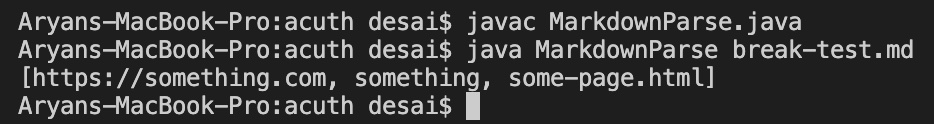
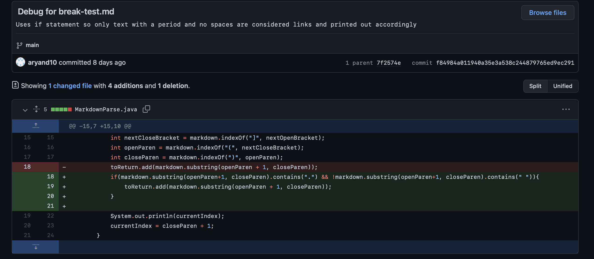
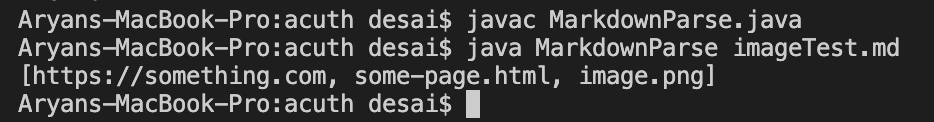
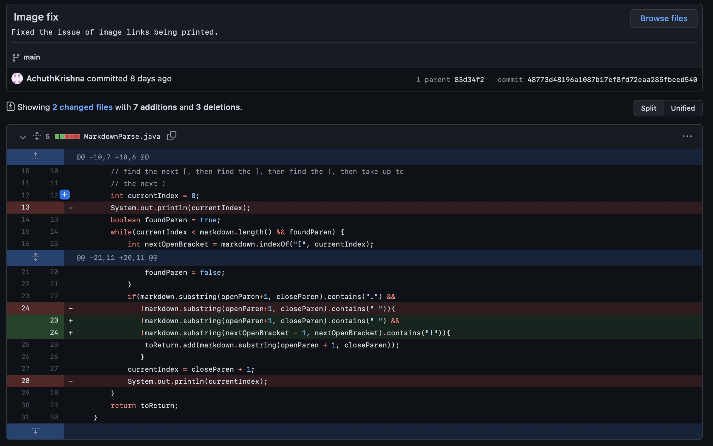
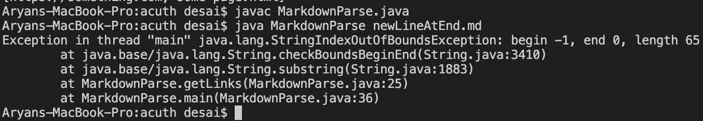
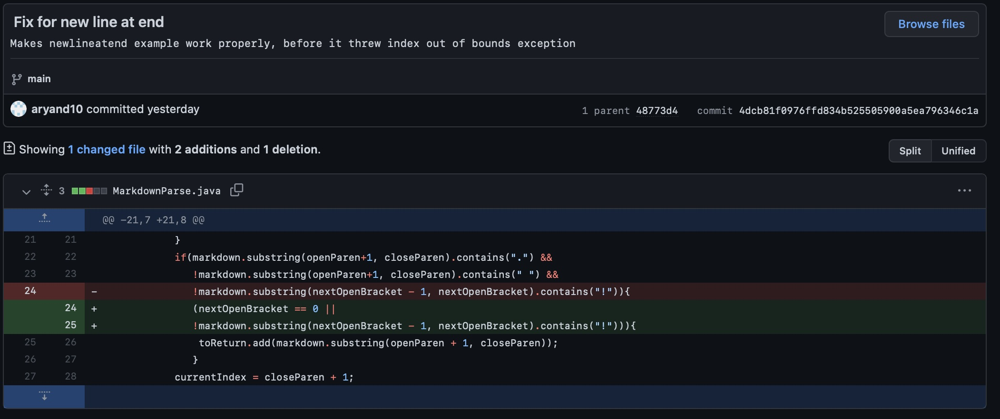

# Lab Report 2 (Week 4)

Hello! This page covers some of the errors and their respective solutions for a program called `MarkdownParse`, which has the goal of getting all web links from a `.md` file!

## Error 1: "Not A Link"
___

The file that induced this specific error was:
[`break-test.md`](https://github.com/aryand10/markdown-parse/blob/main/break-test.md)

___

The above image shows what happened initially when `MarkdownParse` was run with `break-test.md`.

___

To fix the bug that caused the error, the above changes were made to the code.

**Relationship Between Bug, Symptom, and Error**

This bug was induced by the `break-test.md` file, which when ran through `MarkdownParse.java`, resulted in the word `something` being placed in the links array and printed, even though `something` was not a link. The word `something` was placed in parentheses with brackets preceding it but was not a link. This was caused by the program simply look for any text in parenthesis with brackets beforehand. This was corrected by adding an if statement to the code that only added text to the links array if it did not have any spaces and featured a "`.`" in the text to ensure it was a link. Thus, when `break-test.md` was tested again, the additional `something` text was not printed.

## Error 2: Avoiding Image Links
___

The file that induced this specific error was:
[`imageTest.md`](https://github.com/aryand10/markdown-parse/blob/main/imageTest.md)

___

The above image shows what happened initially when `MarkdownParse` was run with `imageTest.md`.

___

To fix the bug that caused the error, the above changes were made to the code.

**Relationship Between Bug, Symptom, and Error**

The file, `imageTest.md`, had a line in which there was an image in the `.md` file, which features similar syntax for a link in a `.md` file, the only difference being an exclamation point before the first set of brackets. The result of this file being tested was an image address being added to the links array and printed in markdown parse. To fix this bug, an if-statement was added to ensure that if an exclamation point was present before the first brackets, the contents inside the parenthesis would not be added to the links array and be printed. Thus, when `imageTest.md` was tested again, the image address was not printed.

## Error 3: New Line at End Error
___

The file that induced this specific error was:
[`newLineAtEnd.md`](https://github.com/aryand10/markdown-parse/blob/main/newLineAtEnd.md)

___

The above image shows what happened initially when `MarkdownParse` was run with `newLineAtEnd.md`.

___

To fix the bug that caused the error, the above changes were made to the code.

**Relationship Between Bug, Symptom, and Error**

The file, `newLineAtEnd.md`, featured an empty line at the end of the file after two links were present. This resulted in an `IndexOutOfBoundsException` in which the code since the indices did not exist for the line at the end because it was empty. To fix this, a line was added for one of the if-statement that would ensure the next open bracket was at index 0 or there was not an exclamation point at index 0. As a result, an index out of bounds error was not thrown when running `newLineAtEnd.md` with `MarkdownParse.java`.

Now you are familiar with some of the common errors that you can encounter while programming as well as the solutions to fix them!

