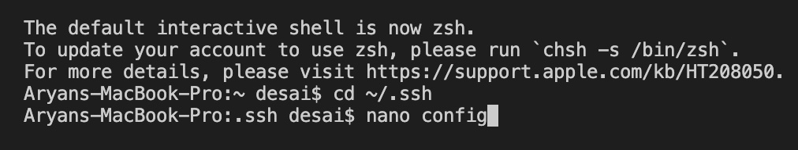
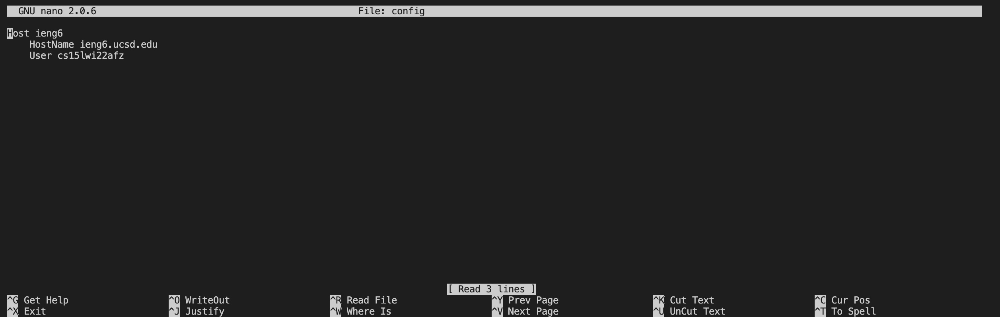
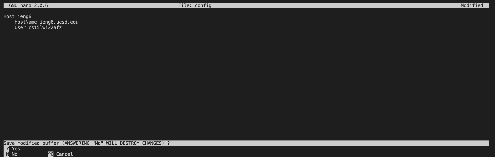
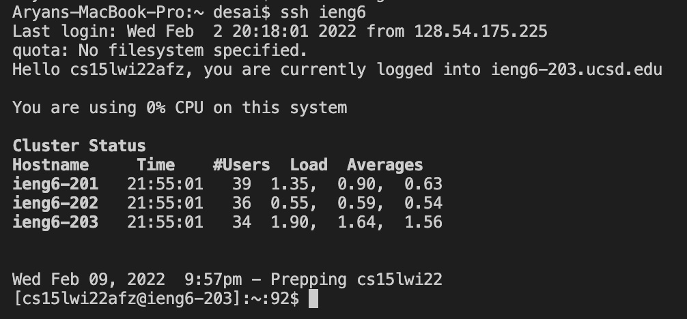
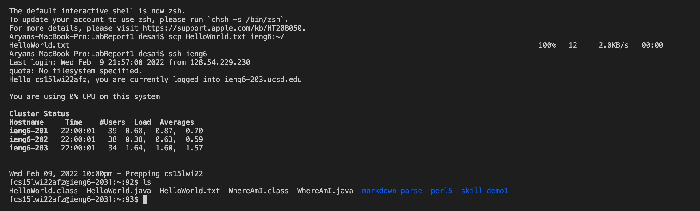

# Lab Report 1 (Week 6)


Hello! This page covers how to streamline your `ssh` login! Logging onto `ieng6` using `ssh` can sometimes have errors when you have to type in your long username incorrectly. We'll discuss how you can set up a shortcut so you can use a much more convenient input than using your long username each time to log onto `ieng6` using `ssh`. This page assumes you have already set up an `ssh` key such that you no longer have to enter your password. If you need help with this, you can refer to [this webpage](https://aryand10.github.io/cse15l-lab-reports/lab-report-1-week-2.html). The tutorial on this page is primarily for Mac users. 

## Setting Up Your `ssh` Configuration
---
First, we'll have to cofugure the `ssh` file on your computer. Go to your terminal on your Mac.

>You can use Terminal or VSCode for this. 

To access your `.ssh/config` file, use the command `cd ~/.ssh` from your main user directory (this should be the default directory in a new terminal). Then, type the command `nano config` to create a `config` file in this directory. These two steps should appear like the image below. 

---

***

Once you enter the `nano config` command, the `nano` editor will appear. In the `nano` editor, paste the following code.
```
Host ieng6
    HostName ieng6.ucsd.edu
    User cs15lwi22zzz (use your username instead)
```
This step should look like the following image. 

---

***

To save this, perform `Control+x`. When asked whether or not to save the file, simply enter `y` to confirm that the file should be saved. This screen will appear as follows.

---

***

You can just click `return` on your keyboard to leave the `nano` editor. 

## Using the `ssh` Alias
---

Now you are ready to log on to `ieng6` with `ssh` with your new shortcut alias. To log on to `ieng6` using `ssh` now, you should only have to enter the command `ssh ieng6`, and this will log you in to `ieng6`. It should look something like the image below. 

---



## Moving over files with `scp` using the `ssh` alias shortcut
---

You can also use the shortened `ssh` alias shortcut to `scp` files over into your `ieng6` account. The framework for this command would be as follows. 
```
scp FileName ieng6:~/
```
> Make sure you are working in the directory that has your file in it!

As an example of using this command, let's say I wanted to `scp` a file called `HelloWorld.txt` to my `ieng6` account. I can use the following command.
```
scp HelloWorld.txt ieng6:~/
```

This will add the file to my account on `ieng6`. An image of this can be seen below. 

---


To double check that this file was successfully added to my `ieng6` account, I then logged on to `ieng6` and used the `ls` command to see what files were in my `ieng6` directory. As you can see, the file `HelloWorld.txt` was successfully transferred to my `ieng6` directory.
***

There you have it! Now you have a shortcut and alias that you can use to log on to and use commands for `ieng6` in a faster and more efficient way!


