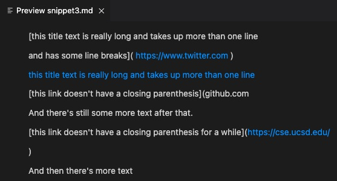
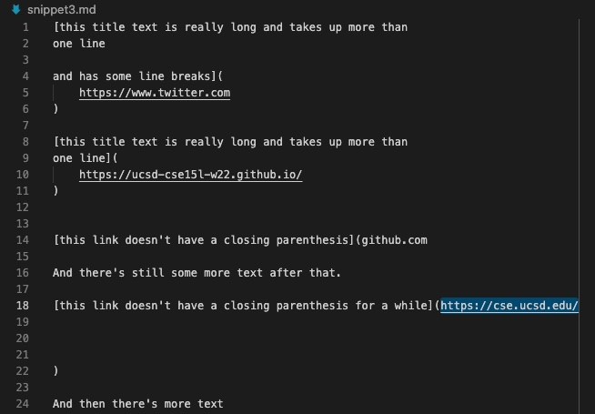
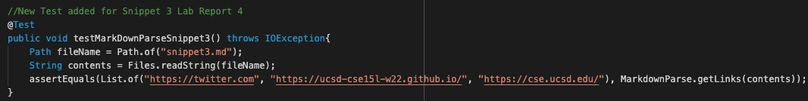
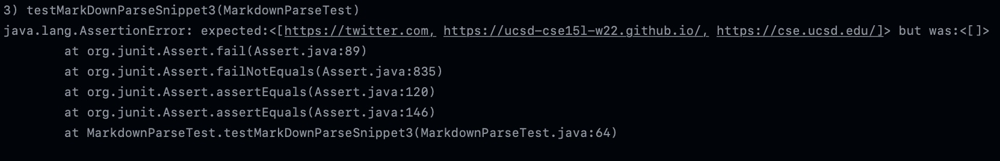
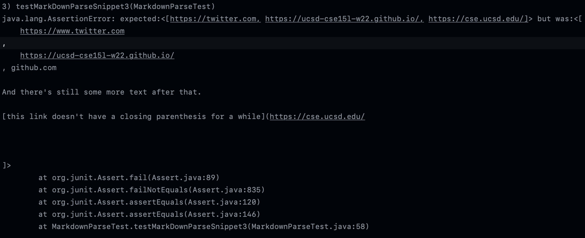

# Lab Report 4 (Week 8)


Hello! This page contains Lab Report 4. The information for this lab can be found [here](https://ucsd-cse15l-w22.github.io/week/week8/#week-8-lab-report).

## `MarkdownParse` Repository Links
---

Here is a link to [my `MarkdownParse` repository](https://github.com/aryand10/markdown-parse). Here is a link to [another `MarkdownParse` repository](https://github.com/yi113/markdown-parse). These two versions of `MarkdownParse` will be focused on for this lab. 

## Snippet 1 Testing 
---

Below is a code snippet for a sample file that is designed to test an edge case for `MarkdownParse.java`. 

```
`[a link`](url.com)

[another link](`google.com)`

[`cod[e`](google.com)

[`code]`](ucsd.edu)
```

**Expected Outputs**

When used in a `.md` file, the expected preview for the `Markdown` would be a page like the one below. 


When tested with our versions of `MarkdownParse.java` the `getLinks` method would return a list as follows:
```
[“`google.com”, “google.com”, “ucsd.edu”]
```

**Testing this Snippet**

First create a file titled `snippet1.md` containing the code for the Snippet as detailed above. The file you created should look like the image below.


Then, in the `MarkdownParseTest.java` file, we will add a `JUnit` test for this file. Add the following code into `MarkdownParseTest.java`.
```
//New Test added for Snippet 1 Lab Report 4
@Test
public void testMarkDownParseSnippet1() throws IOException{
    Path fileName = Path.of("snippet1.md");
    String contents = Files.readString(fileName);
    assertEquals(List.of("'google.com", "google.com", "ucsd.edu"), MarkdownParse.getLinks(contents));
}
```
It should look something like the image below.


**Testing Output**

For my version of `MarkdownParse` the test for Snippet 1 failed. The below image showcases the `JUnit` output that shows the test faulure.


This test also failed for the other version of `MarkdownParse`. The below image showcases the `JUnit` output that shows the test failure.


## Snippet 2 Testing 
---

Below is another code snippet for a sample file that is designed to test another edge case for `MarkdownParse.java`. 

```
[a [nested link](a.com)](b.com)

[a nested parenthesized url](a.com(()))

[some escaped \[ brackets \]](example.com)
```

**Expected Outputs**

When used in a `.md` file, the expected preview for the `Markdown` would be a page like the one below. 


When tested with our versions of `MarkdownParse.java` the `getLinks` method would return a list as follows:
```
[“a.com”, “a.com(())”, “example.com”]
```

**Testing this Snippet**

First create a file titled `snippet2.md` containing the code for the Snippet as detailed above. The file you created should look like the image below.


Then, in the `MarkdownParseTest.java` file, we will add a `JUnit` test for this file. Add the following code into `MarkdownParseTest.java`.
```
//New Test added for Snippet 2 Lab Report 4
@Test
public void testMarkDownParseSnippet2() throws IOException{
    Path fileName = Path.of("snippet2.md");
    String contents = Files.readString(fileName);
    assertEquals(List.of("a.com", "a.com(())", "example.com"), MarkdownParse.getLinks(contents));
}
```
It should look something like the image below.


**Testing Output**

For my version of `MarkdownParse` the test for Snippet 2 failed. The below image showcases the `JUnit` output that shows the test faulure.


This test also failed for the other version of `MarkdownParse`. The below image showcases the `JUnit` output that shows the test failure.


## Snippet 3 Testing 
---

Below is a code snippet for another sample file that is designed to test another edge case for `MarkdownParse.java`. 

```
[this title text is really long and takes up more than 
one line

and has some line breaks](
    https://www.twitter.com
)

[this title text is really long and takes up more than 
one line](
    https://ucsd-cse15l-w22.github.io/
)


[this link doesn't have a closing parenthesis](github.com

And there's still some more text after that.

[this link doesn't have a closing parenthesis for a while](https://cse.ucsd.edu/


)

And then there's more text
```

**Expected Outputs**

When used in a `.md` file, the expected preview for the `Markdown` would be a page like the one below. 



When tested with our versions of `MarkdownParse.java` the `getLinks` method would return a list as follows:
```
[“https://twitter.com”, “https://ucsd-cse15l-w22.github.io/“, “https://cse.ucsd.edu/“]
```

**Testing this Snippet**

First create a file titled `snippet3.md` containing the code for the Snippet as detailed above. The file you created should look like the image below.


Then, in the `MarkdownParseTest.java` file, we will add a `JUnit` test for this file. Add the following code into `MarkdownParseTest.java`.
```
//New Test added for Snippet 3 Lab Report 4
@Test
public void testMarkDownParseSnippet3() throws IOException{
    Path fileName = Path.of("snippet3.md");
    String contents = Files.readString(fileName);
    assertEquals(List.of("https://twitter.com", "https://ucsd-cse15l-w22.github.io/", "https://cse.ucsd.edu/"), MarkdownParse.getLinks(contents));
}
```
It should look something like the image below.


**Testing Output**

For my version of `MarkdownParse` the test for Snippet 3 failed. The below image showcases the `JUnit` output that shows the test faulure.


This test also failed for the other version of `MarkdownParse`. The below image showcases the `JUnit` output that shows the test failure.


## Additional Questions
---
1) Do you think there is a small (<10 lines) code change that will make your program work for snippet 1 and all related cases that use inline code with backticks? If yes, describe the code change. If not, describe why it would be a more involved change.

For my markdown parse, to fix this error I do think there is a small code change that could potentially work. The change to be made will simply be an ‘if’ statement that would search for backticks before the first bracket for a link. This if statement would result in that line being skipped and the code moving on to the next potential link.  

2) Do you think there is a small (<10 lines) code change that will make your program work for snippet 2 and all related cases that nest parentheses, brackets, and escaped brackets? If yes, describe the code change. If not, describe why it would be a more involved change.

There could be a small code change that fixes this issue. You could simply have a loop that after collecting the first open parenthesis, goes through each parenthesis (open or closed) after until it finds a closed parenthesis that does not have another open or close parenthesis immediately after it. This could then be considered the final closed parenthesis and be used as the other bound that encapsulates the link.

3) Do you think there is a small (<10 lines) code change that will make your program work for snippet 3 and all related cases that have newlines in brackets and parentheses? If yes, describe the code change. If not, describe why it would be a more involved change.

There could be a simple code change that fixes the issue. To ensure that new lines are allowed within the brackets and parenthesis, you could uses String.trim() to eliminate all white space in the contents of the file first. Then, after all the white space is eliminated (which includes new lines), you could run the code normally as it typically functions without errors when new lines are not there. 

___


