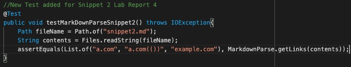

# Lab Report 4 (Week 8)


Hello! This page contains Lab Report 4. The information for this lab can be found [here](https://ucsd-cse15l-w22.github.io/week/week8/#week-8-lab-report).

## `MarkdownParse` Repository Links
---

Here is a link to [my `MarkdownParse` repository](https://github.com/aryand10/markdown-parse). Here is a link to [another `MarkdownParse` repository](https://github.com/yi113/markdown-parse). These two versions of `MarkdownParse` will be focused on for this lab. 

## Snippet 1 Testing 
---

Below is a code snippet for a sample file that is designed to test an edge case for `MarkdownParse.java`. 

```
`[a link`](url.com)

[another link](`google.com)`

[`cod[e`](google.com)

[`code]`](ucsd.edu)
```

**Expected Outputs**

When used in a `.md` file, the expected preview for the `Markdown` would be a page like the one below. 


When tested with our versions of `MarkdownParse.java` the `getLinks` method would return a list as follows:
```
[“`google.com”, “google.com”, “ucsd.edu”]
```

**Testing this Snippet**

First create a file titled `snippet1.md` containing the code for the Snippet as detailed above. The file you created should look like the image below.


Then, in the `MarkdownParseTest.java` file, we will add a `JUnit` test for this file. Add the following code into `MarkdownParseTest.java`.
```
//New Test added for Snippet 1 Lab Report 4
@Test
public void testMarkDownParseSnippet1() throws IOException{
    Path fileName = Path.of("snippet1.md");
    String contents = Files.readString(fileName);
    assertEquals(List.of("'google.com", "google.com", "ucsd.edu"), MarkdownParse.getLinks(contents));
}
```
It should look something like the image below.


**Testing Output**

For my version of `MarkdownParse` the test for Snippet 1 failed. The below image showcases the `JUnit` output that shows the test faulure.


This test also failed for the other version of `MarkdownParse`. The below image showcases the `JUnit` output that shows the test failure.


## Snippet 2 Testing 
---

Below is another code snippet for a sample file that is designed to test another edge case for `MarkdownParse.java`. 

```
[a [nested link](a.com)](b.com)

[a nested parenthesized url](a.com(()))

[some escaped \[ brackets \]](example.com)
```

**Expected Outputs**

When used in a `.md` file, the expected preview for the `Markdown` would be a page like the one below. 


When tested with our versions of `MarkdownParse.java` the `getLinks` method would return a list as follows:
```
[“a.com”, “a.com(())”, “example.com”]
```

**Testing this Snippet**

First create a file titled `snippet2.md` containing the code for the Snippet as detailed above. The file you created should look like the image below.


Then, in the `MarkdownParseTest.java` file, we will add a `JUnit` test for this file. Add the following code into `MarkdownParseTest.java`.
```
//New Test added for Snippet 2 Lab Report 4
@Test
public void testMarkDownParseSnippet2() throws IOException{
    Path fileName = Path.of("snippet2.md");
    String contents = Files.readString(fileName);
    assertEquals(List.of("a.com", "a.com(())", "example.com"), MarkdownParse.getLinks(contents));
}
```
It should look something like the image below.


**Testing Output**

For my version of `MarkdownParse` the test for Snippet 2 failed. The below image showcases the `JUnit` output that shows the test faulure.


This test also failed for the other version of `MarkdownParse`. The below image showcases the `JUnit` output that shows the test failure.


