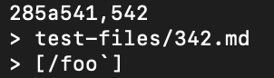

# Lab Report 5 (Week 10)


Hello! This page contains Lab Report 5. The information for this lab can be found [here](https://ucsd-cse15l-w22.github.io/week/week10/#lab-report-5).

## Findings Tests with Different Results
---

In order to find tests with different results from `MarkdownParse`, a file called `script.sh` was created with the contents below.
```
for file in test-files/*.md;
do
  echo $file
  java MarkdownParse $file
done
```
This file essentially runs `MarkdownParse` with every file in the `test-files` folder. To run the results of `script.sh` directly into a new file, the following command was ran.
```
bash script.sh > results.txt
```
This command means the results of running `MarkdownParse` with all test files were outputted to a file called `results.txt`. The contents of this file will look something like the image below.


The same commands were used for the other version of `MarkdownParse` being analyzed in this lab. Once both `results.txt` files were created for the respective versions of `MarkdownParse`, the following command was used. 
```
diff [file-path for first results.txt] [file-path for second results.txt]
```
For my specific usage, the command looked like this below.
```
diff markdown-parse/results.txt markdown-parse-week9/results.txt
```
This produced an output that contained all the differences between both `results.txt` files for each version of `MarkdownParse`. The output thus represented all the differences in testing the same set of files with both versions of `MarkdownParse`.

This output was then manually examined to find differences in testing results that will be discussed in this lab report next. 

## Testing Difference #1: `test-files/403.md`
---
For this specific testing difference, the output from the `diff` command was the image below. 


The first line of this output from above indicates that the line that was different from `results.txt` from our version of `MarkdownParse` was line 367. The rest of the output indicates that for the test on this given line, our version of `MarkdownParse` produced an empty list of linked while the other version of `MarkdownParse` produced the link "`/url`".

 If we look at the `results.txt` file for our `MarkdownParse`, we can see that the test output for this was for `test-files/403.md`. This file contained the contents below.


This results in a `Markdown` as follows.


In this `Markdown`, the link "`/url`" was properly received, which means the other version of `MarkdownParse` was correct and our version of `MarkdownParse` was wrong.

Below is the `getLinks` method from our version of `MarkdownParse`.


The highlighted portion is the cause for this error. The highlighted portion on line 45 involves a statement that requires a "`.`" to be bresent in the link for it to be counted as a link and added to the output array of links. As a result, the link in `test-files/403.md` was not accounted for in our version of `MarkdownParse`. To fix this, an `or` operator can be added paired with an additional conditional statement that allows something to be counted as a link if it contains "`/`" as well as the original statement involving "`.`". This would result in both versions of `MarkdownParse` having the correct output.

## Testing Difference #2: `test-files/342.md`
---
For this specific testing difference, the output from the `diff` command was the image below. 


The first line of this output from above indicates that the line that was different from `results.txt` from our version of `MarkdownParse` was line 285. The rest of the output indicates that for the test on this given line, our version of `MarkdownParse` could not output anything (most likely due to an exception) while the other version of `MarkdownParse` produced the link "/foo`".

 If we look at the `results.txt` file for our `MarkdownParse`, we can see that the test output for this was for `test-files/342.md`. This file contained the contents below.


This results in a `Markdown` as follows.


In this `Markdown`, there are no links, rather a code block that is produced due to the presence of back ticks. Since both version of `MarkdownParse` were wrong, we can just look at the cause of this error and how it can be fixed for one of them. Since this did not even produce any output for our version of `MarkdownParse`, let's take a look at the other version of `MarkdownParse`.

Below is the `getLinks` method for the other version of `MarkdownParse`


The highlighted portion is what can be adjusted to fix this bug. For the potential link, a line can be added to the `if` statement that checks if the potential link has any back ticks. If the potential link has any back ticks, then it should not be included as links do not have back ticks. Then, any potential link with back ticks would not be added to the links array that is returned. Another possible solution would be a methodology similary to the one used to look for open and close parenthesis that instead looks for a pair of back ticks. If a pair of back ticks is detected, then it would not have to move on to the part of collecting the potential link. Either of these fixes would result in this other version of `MarkdownParse` having the correct output for `test-files/342.md`.

---
This concludes all the lab reports for CSE15L. Thanks for checking them out! Happy Coding!